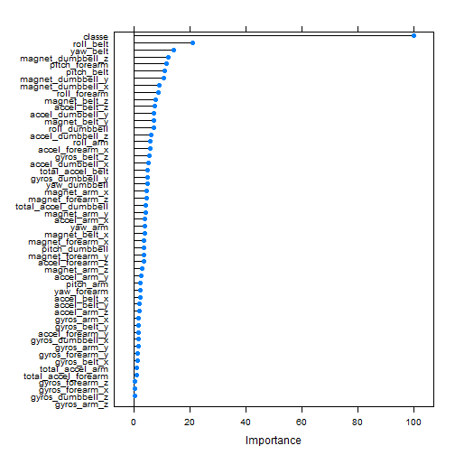

Coursera - Practical Machine Learning Project Writeup
=====================================================

Using devices such as Jawbone Up, Nike FuelBand, and Fitbit it is now possible to collect a large amount of data about personal activity relatively inexpensively.
We write a predictive algorithm to analyse the activity of individual persons in the dataset.


```r
library(knitr)
library(caret)
library(randomForest)
options(warn = -1)
```

## Data Modelling

We first get rid of NAs and `#DIV/0!` to make the data error free while loading.


```r
train_data <- read.csv("pml-training.csv", na.strings = c("#DIV/0!"))
test_data <- read.csv("pml-testing.csv", na.strings = c("#DIV/0!"))
```

We cast the columns to be numeric.


```r
for (i in c(8:ncol(train_data) - 1)) {
    train_data[, i] = as.numeric(as.character(train_data[, i]))
}
for (i in c(8:ncol(test_data) - 1)) {
    test_data[, i] = as.numeric(as.character(test_data[, i]))
}
```

We only take the columns with complete data and leave out the incomplete ones.


```r
train_subset <- colnames(train_data[colSums(is.na(train_data)) == 0])[-(1:7)]
train_data2 <- train_data[train_subset]
train_subset
```

```
##  [1] "roll_belt"            "pitch_belt"           "yaw_belt"            
##  [4] "total_accel_belt"     "gyros_belt_x"         "gyros_belt_y"        
##  [7] "gyros_belt_z"         "accel_belt_x"         "accel_belt_y"        
## [10] "accel_belt_z"         "magnet_belt_x"        "magnet_belt_y"       
## [13] "magnet_belt_z"        "roll_arm"             "pitch_arm"           
## [16] "yaw_arm"              "total_accel_arm"      "gyros_arm_x"         
## [19] "gyros_arm_y"          "gyros_arm_z"          "accel_arm_x"         
## [22] "accel_arm_y"          "accel_arm_z"          "magnet_arm_x"        
## [25] "magnet_arm_y"         "magnet_arm_z"         "roll_dumbbell"       
## [28] "pitch_dumbbell"       "yaw_dumbbell"         "total_accel_dumbbell"
## [31] "gyros_dumbbell_x"     "gyros_dumbbell_y"     "gyros_dumbbell_z"    
## [34] "accel_dumbbell_x"     "accel_dumbbell_y"     "accel_dumbbell_z"    
## [37] "magnet_dumbbell_x"    "magnet_dumbbell_y"    "magnet_dumbbell_z"   
## [40] "roll_forearm"         "pitch_forearm"        "yaw_forearm"         
## [43] "total_accel_forearm"  "gyros_forearm_x"      "gyros_forearm_y"     
## [46] "gyros_forearm_z"      "accel_forearm_x"      "accel_forearm_y"     
## [49] "accel_forearm_z"      "magnet_forearm_x"     "magnet_forearm_y"    
## [52] "magnet_forearm_z"     "classe"
```


## Cross Validation

We do cross validation of data splitting the training data into training and testing data. Data partitioning is done using the `classe` variable.
We used 60% for training and 40% for testing respectively.


```r
d_cv <- createDataPartition(train_data2$classe, p = 0.6, list = FALSE)

train_part <- train_data2[d_cv, ]
test_part <- train_data2[-d_cv, ]
```


## Prediction Algorithm

We used the randon forest model for prediction


```r
model.rf <- train(train_part[, -57], train_part$classe, tuneGrid = data.frame(mtry = 3), 
    trControl = trainControl(method = "none"))
```


Estimate errors for training and test data

```r
err_train <- predict(model.rf, newdata = train_part)
confusionMatrix(err_train, train_part$classe)
```

```
## Confusion Matrix and Statistics
## 
##           Reference
## Prediction    A    B    C    D    E
##          A 3348    0    0    0    0
##          B    0 2279    0    0    0
##          C    0    0 2054    0    0
##          D    0    0    0 1930    0
##          E    0    0    0    0 2165
## 
## Overall Statistics
##                                 
##                Accuracy : 1     
##                  95% CI : (1, 1)
##     No Information Rate : 0.284 
##     P-Value [Acc > NIR] : <2e-16
##                                 
##                   Kappa : 1     
##  Mcnemar's Test P-Value : NA    
## 
## Statistics by Class:
## 
##                      Class: A Class: B Class: C Class: D Class: E
## Sensitivity             1.000    1.000    1.000    1.000    1.000
## Specificity             1.000    1.000    1.000    1.000    1.000
## Pos Pred Value          1.000    1.000    1.000    1.000    1.000
## Neg Pred Value          1.000    1.000    1.000    1.000    1.000
## Prevalence              0.284    0.194    0.174    0.164    0.184
## Detection Rate          0.284    0.194    0.174    0.164    0.184
## Detection Prevalence    0.284    0.194    0.174    0.164    0.184
## Balanced Accuracy       1.000    1.000    1.000    1.000    1.000
```

```r


err_test <- predict(model.rf, newdata = test_part)
confusionMatrix(err_test, test_part$classe)
```

```
## Confusion Matrix and Statistics
## 
##           Reference
## Prediction    A    B    C    D    E
##          A 2232    0    0    0    0
##          B    0 1518    3    0    0
##          C    0    0 1365    0    0
##          D    0    0    0 1286    0
##          E    0    0    0    0 1442
## 
## Overall Statistics
##                                     
##                Accuracy : 1         
##                  95% CI : (0.999, 1)
##     No Information Rate : 0.284     
##     P-Value [Acc > NIR] : <2e-16    
##                                     
##                   Kappa : 1         
##  Mcnemar's Test P-Value : NA        
## 
## Statistics by Class:
## 
##                      Class: A Class: B Class: C Class: D Class: E
## Sensitivity             1.000    1.000    0.998    1.000    1.000
## Specificity             1.000    1.000    1.000    1.000    1.000
## Pos Pred Value          1.000    0.998    1.000    1.000    1.000
## Neg Pred Value          1.000    1.000    1.000    1.000    1.000
## Prevalence              0.284    0.193    0.174    0.164    0.184
## Detection Rate          0.284    0.193    0.174    0.164    0.184
## Detection Prevalence    0.284    0.194    0.174    0.164    0.184
## Balanced Accuracy       1.000    1.000    0.999    1.000    1.000
```


## Variable Importance


```r
plot(varImp(model.rf))
```

 


## Conclusion

Random forest algorithm was pretty accurate in predicting the activities from data provided by the devices.
